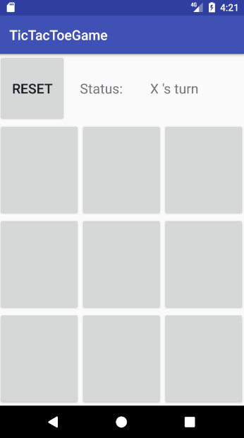

# Tic Tac Toe Game
A sample layout playing Tic Tac Toe Game in Android. 
 Using Min Max Algorithm as AI vs player. 
 The  algorithm do not apply deep tree tracking.

Rule to be used:
AI:
 
+100 when can draw a line
 
+10 when there are 2 in a line
 
+1 when there are 1 in a line

Opponent:
 
+100 when there are 2 in a line
 
+10 when there are 1 in a line
 
+1 when there are 0 in a line

# Demo

# More info
You can find a working example of demo module included in the source. 
